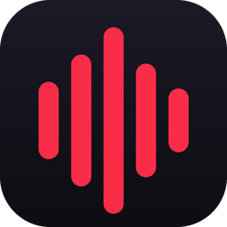

<div align="center">



# Cadence

**An Apple Music companion for Windows — and a diagnostic tool for when Apple Music breaks.**

</div>

Apple ships no plugin or extension API for Apple Music on Windows. But the app
publishes a media session to Windows like every other player, and that session
is both readable and writable. Cadence sits on top of it: a themeable
always-on-top player with synced lyrics, global hotkeys and local listening
stats, plus a repair panel that reads Apple Music's own trace logs when it
misbehaves.

No Apple developer account, no API key, no login. It drives the Apple Music app
you already have installed.

---

## What it does

**Player**
- Now playing with high-resolution artwork, transport controls and a seekable scrubber
- Time-synced lyrics that scroll and highlight the current line
- Four layouts — card, bar, compact, artwork-only — switchable with a hotkey
- Adaptive theming: the whole interface re-tints to colours sampled from the album art

**Listening stats**
- Every play logged to a local SQLite database, never uploaded
- Top artists, tracks and albums; a 26-week activity heatmap; plays by hour of day
- A play counts once it passes 60 seconds or half the track, so skips don't pollute your history

**Global hotkeys**
- Play/pause, next, previous, show/hide, cycle layout, toggle click-through
- Fully rebindable, with conflict detection when another app already owns a combination

**Fix Apple Music**
- Detects "skip storms" — the failure where the library races past every track
- A live watch that records media-key traffic and correlates it with track changes
- Decodes Apple Music's own ETL traces to surface the real error codes
- One-click repairs, each of which takes a timestamped backup before touching anything

**Customisation**
- Nine built-in themes plus adaptive artwork tinting and an accent override
- Opacity, scale, corner radius, Mica backdrop, click-through, blurred art backdrop
- Font family and size; every element in the player individually toggleable
- A custom CSS box that is injected last, so anything you don't like can be overridden

---

## Install

### Download the binary

Grab `Cadence.exe` from the [latest release](../../releases/latest) and run it.
No installer.

Windows SmartScreen warns about unsigned binaries — **More info → Run anyway**,
or build from source below.

### Run from source

```bat
git clone https://github.com/YOUR-USERNAME/cadence.git
cd cadence
Cadence.bat
```

`Cadence.bat` creates the virtual environment and installs dependencies on
first run. After that it just launches.

Manually, if you prefer:

```bat
python -m venv .venv
.venv\Scripts\pip install -r requirements.txt
.venv\Scripts\python -m cadence
```

**Requirements:** Windows 10/11, Python 3.10+, the WebView2 runtime (already
present on Windows 11), and the Apple Music app from the Microsoft Store.

---

## Fixing "Apple Music skips every song instantly"

This is the failure Cadence was extended to diagnose: you press play and the
app races through your entire library, a few tracks per second, never playing
anything.

Three unrelated faults produce that identical symptom, and they need opposite
fixes. Guessing wastes time — so Cadence measures instead.

**Open the Fix panel (the wrench icon) and work down it.**

### Step 1 — Watch it happen

Starts a low-level keyboard hook that records **only** media and volume
virtual-key codes (`0xAD`–`0xB3`); ordinary keystrokes are never inspected.
It correlates key events against track changes and tells you which of these is
true:

| Verdict | Meaning | Fix |
|---|---|---|
| `external_software` | An app is sending next-track keys | Close Steam Input, headset companion apps, macro/RGB tools one at a time |
| `external_hardware` | Real key presses from hardware | Disconnect Bluetooth headsets and controllers — each AVRCP transport can send next-track |
| `internal` | Nothing pressed next; Apple Music gave up on each track itself | Go to step 2 |

### Step 2 — Read Apple Music's own logs

Apple Music writes ETL traces of every playback attempt to
`%LOCALAPPDATA%\Packages\AppleInc.AppleMusicWin_*\LocalState\Logs`. Cadence
decodes them with `tracerpt` and extracts the error codes:

| Code | Meaning |
|---|---|
| `7505` | Apple refused to hand over the playback asset. **This is the direct cause of instant skipping** — no asset, so the player advances immediately |
| `7608` | A companion store-request failure, usually alongside 7505 |
| `-45061` | `ADIOTPRequest` failed — the device identity handshake with Apple did not succeed, so store requests go out unauthenticated and come back 7505 |
| `-42110` | This machine is not authorised to play protected content |

### Step 3 — Apply the matching repair

If the logs show **7505**, the tracks are being refused by Apple's servers. In
order of likelihood:

1. **Check the subscription is active.** Apple Music → Account → Manage
   Subscription. A lapsed or payment-failed subscription produces exactly this
   error on every track. Nothing local can fix that, and it costs ten seconds
   to rule out.
2. **Reset device identity + FairPlay.** Clears the shared ADI and SC Info
   stores under `C:\ProgramData\Apple*`, backing both up first, so the app
   re-provisions with Apple on next launch.
3. **Start Windows Time.** The identity token is time-based; a stopped
   `w32time` service lets the clock drift until it breaks.
4. **Uninstall legacy iTunes.** iTunes and the Store app share those identity
   stores. If a reset fixes playback but the fault returns, this is the durable
   answer.

> **Note:** clearing the *PlayReady* cache — the advice you'll find in most
> forum threads — does nothing when the error is 7505. PlayReady is a local
> licence store; 7505 is a server-side refusal. Cadence deliberately ranks that
> remedy last and says so.

Every destructive remedy copies the target to a
`*.cadence-backup-YYYYMMDD-HHMMSS` folder beside it before deleting anything.

### Command line

The same diagnosis without the GUI:

```bat
python tools\diagnose_skip.py --scan
python tools\diagnose_skip.py --logs
python tools\diagnose_skip.py --seconds 30
```

---

## How it works

| Module | Responsibility |
|---|---|
| `cadence/media.py` | SMTC bridge — reads and drives the media session on a dedicated WinRT thread |
| `cadence/palette.py` | Extracts a colour scheme from artwork, enforcing WCAG contrast rather than hoping for it |
| `cadence/enrich.py` | High-resolution artwork, genre and year from Apple's public iTunes Search endpoint |
| `cadence/lyrics.py` | Time-synced lyrics from LRCLIB, with binary search for the active line |
| `cadence/history.py` | SQLite play log, stats queries, and the scrobble threshold rule |
| `cadence/hotkeys.py` | `RegisterHotKey` on its own message-pump thread |
| `cadence/win_effects.py` | DWM rounded corners, Mica backdrop, click-through, layered opacity |
| `cadence/applemusic_fix.py` | The diagnosis and repair engine |
| `cadence/web/` | The interface — plain HTML/CSS/JS, no build step, no external assets |

Settings live in `%APPDATA%\Cadence\settings.json` and the history database
sits beside it. Both are plain files you can edit, back up or delete.

### Privacy

Everything stays local. Listening history is a SQLite file on your machine and
is never transmitted. The only outbound requests are to Apple's public iTunes
Search API for metadata and to LRCLIB for lyrics — both are lookups by track
title and artist, both can be turned off in Settings, and neither carries any
identifier. The keyboard hook used by the Fix panel is scoped to seven
media-key codes, runs only while the 20-second watch is active, and records
nothing else.

---

## Building the executable

```bat
.venv\Scripts\pip install pyinstaller
.venv\Scripts\pyinstaller --noconfirm --clean cadence.spec
```

Output lands in `dist\Cadence.exe`.

CI does the same on every `v*` tag and attaches the binary to a Release:

```bat
git tag v1.0.0
git push origin v1.0.0
```

---

## Licence

MIT — see [LICENSE](LICENSE).

Not affiliated with or endorsed by Apple Inc. Apple Music is a trademark of
Apple Inc. Cadence controls the Apple Music app through documented Windows
APIs and does not modify, patch or circumvent it.
